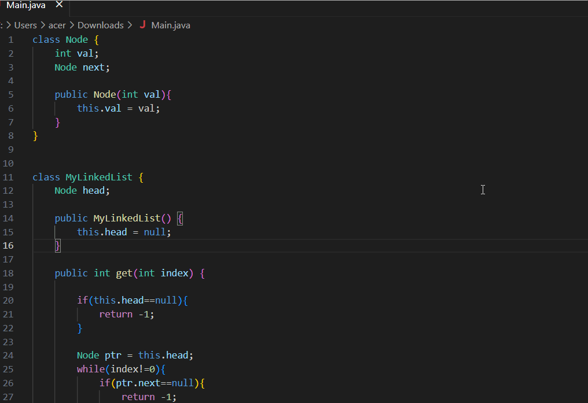

# Code-to-text

Code-to-Text is a Visual Studio Code extension designed to streamline the process of generating comments for your code files. With this extension, you can effortlessly generate informative comments that summarize the functionality and purpose of your code. This repository combines a comment generation modeI with a user-friendly Visual Studio Code extension through an API, providing a seamless experience for developers.

### Features

- **Code Summarization Model:** The repository hosts code summarization models from [SEBIS](https://huggingface.co/SEBIS) as an API. This model is specifically trained to analyze code and generate comments.

- **Effortless Comment Generation:** The Visual Studio Code extension simplifies the comment generation process. It parses your code file and sends a request to the API, allowing you to quickly generate comments without the need for extensive manual writing.

- **Improved Documentation:** By automatically generating comments, Code-to-Text helps improve the overall documentation of your codebase. The [tree-sitter](https://github.com/tree-sitter/tree-sitter) implementation also seperate out method arguments in the comments. It saves you time and ensures that your code is well-documented, making it easier for other developers to understand and collaborate.

- **Customization Options:** The extension offers various customization options, allowing you to change models as per your preferences. You can adjust the number of models loaded at run time based on the codebase you are working on.


# Table of Contents

- [Code-to-text](#code-to-text)
    + [Features](#features)
- [Getting Started](#getting-started)
    + [API Setup](#api-setup)
    + [VS-Extension Setup](#vs-extension-setup)
- [Changing env variables and Models](#changing-env-variables-and-models)
    + [API](#api)
    + [Extension](#extension)
- [Demo](#demo)

# Getting Started

To get started with Code-to-Text, follow these steps:

### API Setup

1. Make sure you have Python installed on your system.
2. Navigate to the `api` directory and create a new environment. Install the required dependencies by running the following commands:

```bash
$ cd api
$ conda create -n env <env_name>
$ conda activate <env_name>
$ pip install -r requirements.txt
```
3. Start the API service by running the `app.py` file:
```bash
$ python app.py
```

### VS-Extension Setup

1. Ensure you have Node.js and npm installed on your system.

2. Navigate to the `extension` directory and install the required dependencies:
```bash
$ cd extension
$ npm i
```
3. Launch the extension by running the `extension.js` file or by pressing `F5` in Visual Studio Code.

4. A new window will open. Open any code file `Ctrl + O` on which you want to generate comments. Use the command palette `F1` or `Ctrl + Shift + P` and type "generate" to trigger the comment generation.

# Changing env variables and Models

### API

1. You can find a `.env` file in the api directory. Open the file using the following command
```bash
$ vi api/.env
```
2. You can change `HOST`, `PORT` or the `ENDPOINT` of the flask service here.

#### Language Support
The current API supports the following languages: Java, Python, JavaScript, Go, Ruby, and PHP. The `api/build` directory contains Python-usable compiled libraries for these languages. Please note that generating comments for other languages may not produce the desired results.

#### Changing Models
The `.env` file in the `api` directory contains variables that point to the Hugging Face repositories of SEBIS language models. By modifying these repository links, you can switch to different models. For example, you can change the Java model from its current [this](https://huggingface.co/SEBIS/code_trans_t5_small_code_documentation_generation_javascript_transfer_learning_finetune) to a larger model by using a link like this [this](https://huggingface.co/SEBIS/code_trans_t5_large_code_comment_generation_java_multitask_finetune) for improved results.

#### Specifying Models to Load at Runtime
The `MODELS` variable in the `.env` file defines the models to load when starting the Flask app. To reduce memory usage, it is recommended to load models only for the languages for which you want to generate comments.

### Extension

1. You can find a `.env` file in the extension directory. Open the file using the following command
```bash
$ vi extension/.env
```
2. You can define `HOST`, `PORT` or the `ENDPOINT` of the flask service here.

# Demo

The following demo uses the SEBIS Java large model, which is different from the model specified in the configuration file. To achieve similar results, it is recommended to use the same model.




Happy coding with Code-to-Text!